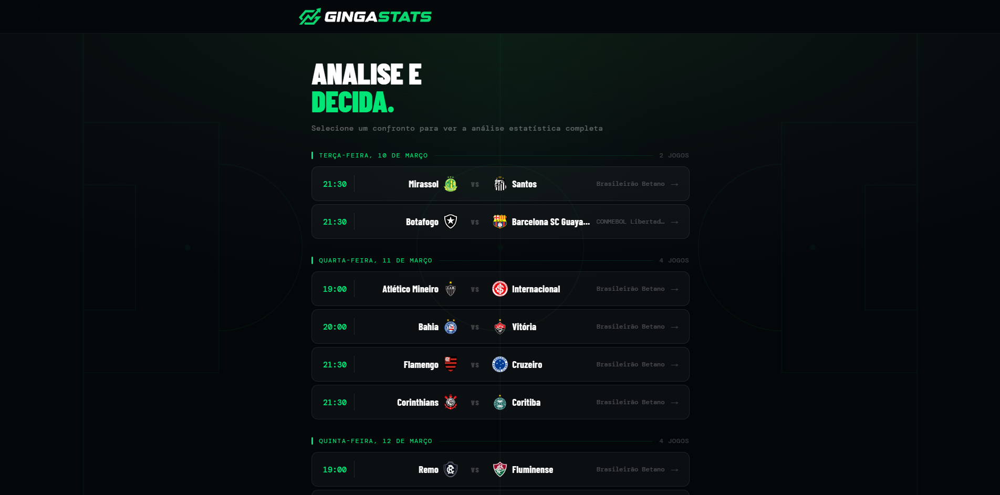
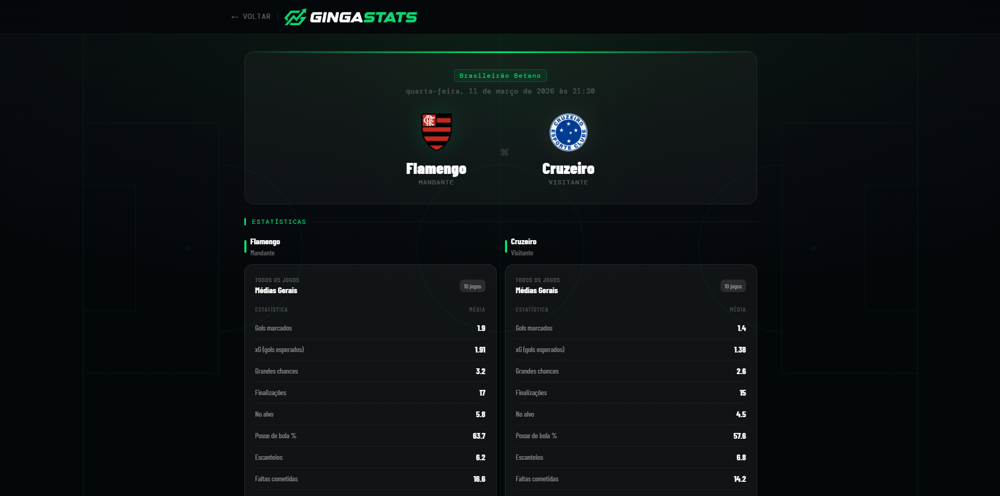
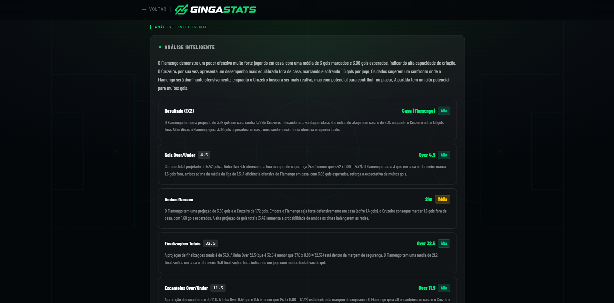

# GingaStats ⚽

Plataforma de análise estatística do futebol brasileiro focada em apostas esportivas. Coleta dados do Sofascore, armazena em PostgreSQL via Supabase, e serve análises com IA (Google Gemini) para os confrontos agendados dos Times do Brasileirão.



---

## Funcionalidades

- Lista de partidas agendadas dos  Times do Brasileirão agrupadas por data
- Estatísticas detalhadas dos últimos N jogos de cada time (médias gerais, médias como mandante/visitante, gols sofridos)
- Análise inteligente gerada por IA com projeções de gols e sugestões para 6 mercados de apostas
- Cache Redis com TTLs configurados por tipo de dado (15min para partidas, 1h para stats, 72h para IA)
- Scraper automatizado via Playwright para coleta semanal dos dados do Sofascore

---

## Stack

| Camada | Tecnologia |
|---|---|
| Frontend | React + Vite + TypeScript + Tailwind |
| Backend | NestJS (TypeScript) |
| Banco de dados | PostgreSQL via Supabase |
| Cache | Redis |
| Scraping | Python + Playwright |
| IA | Google Gemini (gemini-2.5-flash) |

---

## Estrutura do projeto

```
gingastats/
├── gingastats-api/       # Backend NestJS
├── gingastats-web/       # Frontend React
├── gingastats-scraper/   # Scripts Python de coleta
└── docker-compose.yml    # Sobe tudo de uma vez
```

---

## Screenshots

### Página inicial — partidas agendadas


### Confronto — estatísticas comparativas


### Análise IA — mercados e projeções


---

## Rodando com Docker (recomendado)

Pré-requisitos: [Docker](https://www.docker.com/products/docker-desktop) instalado.

**1. Clone o repositório**
```bash
git clone https://github.com/CarlosGilM/gingastats.git
cd gingastats
```

**2. Configure as variáveis de ambiente do backend**
```bash
cp gingastats-api/.env.example gingastats-api/.env
```

Edite `gingastats-api/.env` com suas credenciais:
```dotenv
SUPABASE_URL=https://xxxx.supabase.co
SUPABASE_KEY=sua_chave_aqui
GEMINI_API_KEY=sua_chave_aqui
REDIS_HOST=redis
REDIS_PORT=6379
REDIS_PASSWORD=
```

> ⚠️ Atenção: no Docker o `REDIS_HOST` deve ser `redis`, não `localhost`.

**3. Suba tudo**
```bash
docker-compose up --build
```

| Serviço | URL |
|---|---|
| Frontend | http://localhost:5173 |
| API | http://localhost:3000 |
| Redis | localhost:6379 |

> Após subir o backend, não esqueça de [popular o banco com o scraper](#scraper-python) antes de acessar o frontend.
> 
**4. Para derrubar os containers**
```bash
# Para e remove containers
docker-compose down

```

---

## Rodando sem Docker

### Pré-requisitos

- Node.js 20+
- Python 3.11+
- Redis rodando localmente

**Subir o Redis via Docker (só o Redis):**
```bash
docker run -d --name redis-ginga -p 6379:6379 redis:alpine
```

---

### Backend (NestJS)

```bash
cd gingastats-api
npm install
cp .env.example .env   # preencha as variáveis
npm run start:dev
```

API disponível em `http://localhost:3000`.

**Endpoints:**
```
GET /partidas/agendadas              → lista partidas agendadas
GET /partidas/:id                    → dados de uma partida
GET /analise/confronto/:id?jogos=10  → estatísticas dos dois times
GET /analise/confronto/:id/ia        → análise gerada por IA
```

---

### Frontend (React)

```bash
cd gingastats-web
npm install
npm run dev
```

Frontend disponível em `http://localhost:5173`.

---

### Scraper (Python)

```bash
cd gingastats-scraper
pip install -r requirements.txt
playwright install chromium
cp .env.example .env   # preencha SUPABASE_URL e SUPABASE_KEY
```

**Scripts disponíveis:**

| Script | Descrição |
|---|---|
| `python historico.py` | Coleta histórico dos últimos 10 jogos de cada time (rodar uma vez para popular o banco) |
| `python coleta-semanal.py` | Coleta semanal: último jogo disputado + próximo jogo agendado de cada time |

---

## Banco de dados (Supabase)

O projeto usa PostgreSQL via [Supabase](https://supabase.com). Crie um projeto gratuito e rode o seguinte SQL no editor do Supabase:

```sql
CREATE TABLE times (
    id              SERIAL PRIMARY KEY,
    sofascore_id    INTEGER UNIQUE NOT NULL,
    nome            VARCHAR(100)   NOT NULL,
    slug            VARCHAR(100),                
    created_at      TIMESTAMP DEFAULT NOW()
);

CREATE TABLE partidas (
    id              SERIAL PRIMARY KEY,
    sofascore_id    INTEGER UNIQUE NOT NULL,   
    competicao      VARCHAR(100),
    time_casa_id    INTEGER REFERENCES times(id),
    time_fora_id    INTEGER REFERENCES times(id),
    data            TIMESTAMP      NOT NULL,
    gols_casa       SMALLINT,
    gols_fora       SMALLINT,
    terminou_em     VARCHAR(10),
    pen_casa        SMALLINT,
    pen_fora        SMALLINT,
    created_at      TIMESTAMP DEFAULT NOW()
);

CREATE TABLE estatisticas (
    id                  SERIAL PRIMARY KEY,
    partida_id          INTEGER REFERENCES partidas(id) ON DELETE CASCADE,
    time_id             INTEGER REFERENCES times(id),
    local               VARCHAR(4) NOT NULL CHECK (local IN ('casa', 'fora')),
    gols                SMALLINT,
    gols_esperados      DECIMAL(4,2),
    grandes_chances     SMALLINT,
    finalizacoes        SMALLINT,
    finalizacoes_no_gol SMALLINT,
    posse               SMALLINT,            
    impedimentos        SMALLINT,
    desarmes            SMALLINT,
    faltas_cometidas    SMALLINT,
    escanteios          SMALLINT,
    cartoes_amarelos    SMALLINT,
    cartoes_vermelhos   SMALLINT,
    created_at          TIMESTAMP DEFAULT NOW(),
    UNIQUE (partida_id, time_id)
);

CREATE INDEX idx_estatisticas_time    ON estatisticas(time_id);
CREATE INDEX idx_estatisticas_partida ON estatisticas(partida_id);
CREATE INDEX idx_partidas_data        ON partidas(data);
CREATE INDEX idx_partidas_competicao  ON partidas(competicao);
```

Após criar as tabelas, popule o banco rodando o `historico.py` do scraper.

E busque os confrontos semanais rodando o scraper `coleta-semanal.py`


---

## Variáveis de ambiente

### `gingastats-api/.env`

| Variável | Descrição |
|---|---|
| `SUPABASE_URL` | URL do seu projeto Supabase |
| `SUPABASE_KEY` | Chave anon/public do Supabase |
| `GEMINI_API_KEY` | Chave da API do Google Gemini |
| `REDIS_HOST` | Host do Redis (`localhost` em dev, `redis` no Docker) |
| `REDIS_PORT` | Porta do Redis (padrão: `6379`) |
| `REDIS_PASSWORD` | Senha do Redis (vazio se local) |

### `gingastats-scraper/.env`

| Variável | Descrição |
|---|---|
| `SUPABASE_URL` | URL do seu projeto Supabase |
| `SUPABASE_KEY` | Chave anon/public do Supabase |

---

## Autor

Desenvolvido por **Carlos Gil Martins da Silva**.

Entre em contato!
<br />
<a href="https://www.linkedin.com/in/gilmartinss/" target="_blank"></a>
<a href="https://github.com/CarlosGilM" target="_blank"></a>
